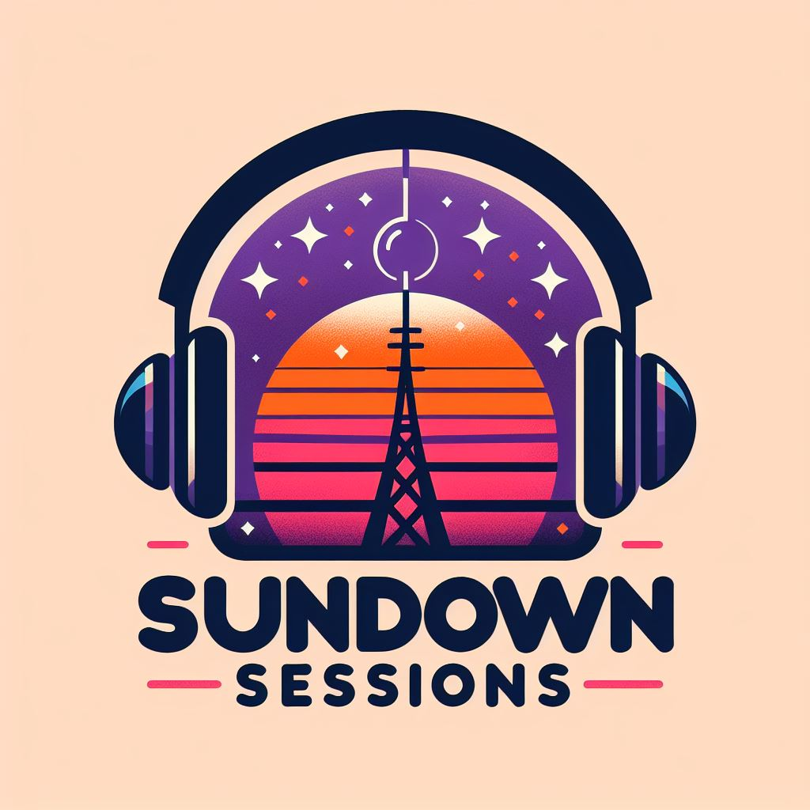

# :octocat: GitHub Action workflows

- :  The current status for the markdown linter

# Project Title

## Overview

This project aims at creating an eclectic radio station application, Sundown Sessions, that provides a diverse range of music from different genres and eras. By intertwining various styles, we ensure a delightful aural experience for our users.

## Highlights

At Sundown Sessions, we believe in the power of music and its ability to bridge gaps across various musical tastes and preferences. This application will enable listeners to discover and enjoy an array of music they might not experience otherwise.

## Purpose

The primary objective of our project is to generate a platform for those exploratory listeners who wish to diversify their musical taste. Our project also promotes artists from different music genres, thereby fostering inclusivity and diversity.

## License

This project is licensed under the terms of the MIT license.

## Contribute

## How to Contribute

We appreciate your interest in contributing to Sundown Sessions. Here are some steps that you can follow:

1. Fork the project repository.

2. Clone your fork locally to your machine.

3. Make your changes in the local repository.

4. Push the changes to your fork.

5. Create a pull request on the Sundown Sessions GitHub repository.

## Code of Conduct

In the interest of fostering an inclusive and respectful environment, we adhere to a [code of conduct](CODE_OF_CONDUCT.md) that all contributors and participants must follow.

## Pull Request Process

1. Ensure any install or build dependencies are removed before the end of the layer when doing a build.

2. Update the README.md with details of changes to the interface, this includes new environment variables, exposed ports, useful file locations and container parameters.

3. Increase the version numbers in any examples files and the README.md to the new version that this Pull Request would represent. 

4. Your contributions will be under the MIT License in which the project is licensed.