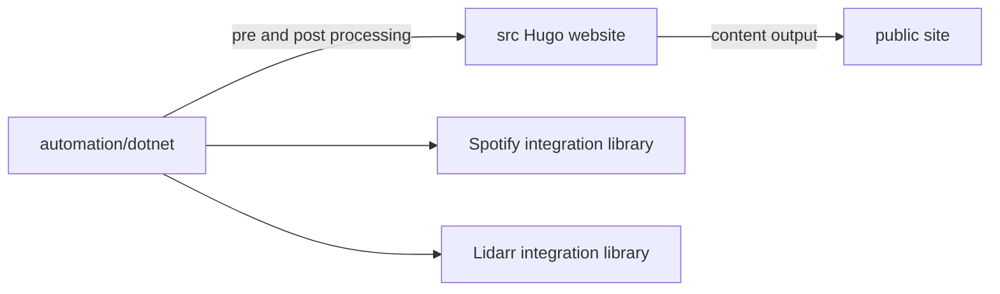
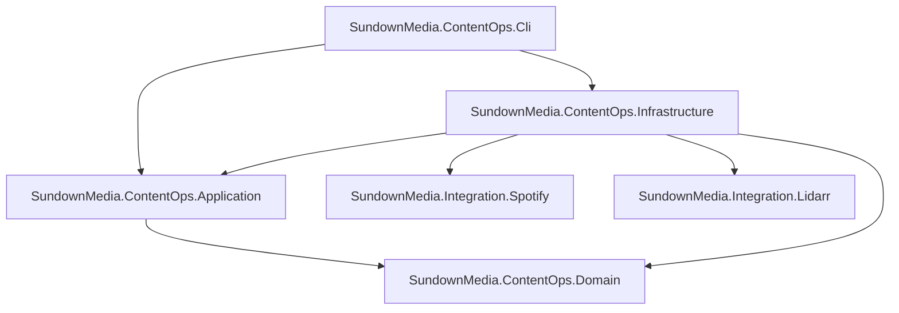
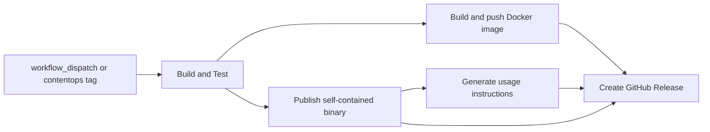

# :octocat: GitHub Action workflows

| Workflow                                                                                                                                                                                                                           | Description                                        |
|------------------------------------------------------------------------------------------------------------------------------------------------------------------------------------------------------------------------------------|----------------------------------------------------|
| [](https://github.com/colin-gourlay/sundown-sessions/blob/main/.github/workflows/lint-markdown.yml)             | The current status of the markdown linter          |
| [](https://github.com/colin-gourlay/sundown-sessions/blob/main/.github/workflows/deploy-github-pages.yml) | The current status of the deployment to production |

---


# Project Title


## Overview

This project aims at creating an eclectic radio station application, Sundown Sessions, that provides a diverse range of music from different genres and eras. By intertwining various styles, we ensure a delightful aural experience for our users.

## Highlights

At Sundown Sessions, we believe in the power of music and its ability to bridge gaps across various musical tastes and preferences. This application will enable listeners to discover and enjoy an array of music they might not experience otherwise.

## Purpose

The primary objective of our project is to generate a platform for those exploratory listeners who wish to diversify their musical taste. Our project also promotes artists from different music genres, thereby fostering inclusivity and diversity.

## License

[](LICENSE)

This project is licensed under the terms of the [MIT license](LICENSE). The MIT license requires that all copies or distributions of this software retain the original copyright notice and license text, ensuring attribution to the original author.

## Contribute

## How to Contribute

We appreciate your interest in contributing to Sundown Sessions. Here are some steps that you can follow:

1. Fork the project repository.

2. Clone your fork locally to your machine.

3. Make your changes in the local repository.

4. Push the changes to your fork.

5. Create a pull request on the Sundown Sessions GitHub repository.

## Code of Conduct

In the interest of fostering an inclusive and respectful environment, we adhere to a [code of conduct](CODE_OF_CONDUCT.md) that all contributors and participants must follow.

## Pull Request Process

1. Ensure any install or build dependencies are removed before the end of the layer when doing a build.

2. Update the README.md with details of changes to the interface, this includes new environment variables, exposed ports, useful file locations and container parameters.

3. Increase the version numbers in any examples files and the README.md to the new version that this Pull Request would represent. 

4. Your contributions will be under the [MIT License](LICENSE) in which the project is licensed.

---

## ContentOps Automation Platform

### Why This Exists

The Hugo site under `src/` is the production website surface. The music ingestion and curation process happens before content reaches Hugo and requires repeatable automation.

To support that requirement, this repository now includes a dedicated automation workspace under `automation/dotnet` for pre and post processing workflows. The first workflow target is album intake and preparation, with Spotify and Lidarr integration designed as reusable libraries for future pipelines.

### Placement and Boundaries

- `src/` remains Hugo only.
- `automation/dotnet` contains operational automation code.
- Spotify and Lidarr integrations are independent and reusable, not coupled to the CLI.


```mermaid
flowchart LR
		A[src Hugo website] -->|content output| B[public site]
		C[automation/dotnet] -->|pre and post processing| A
		C --> D[Spotify integration library]
		C --> E[Lidarr integration library]
```

### Architectural Choices and Rationale

#### .NET 10

- The solution targets `net10.0` to align with forward-looking runtime strategy.
- `global.json` pins the SDK baseline for deterministic local and CI behavior.

#### Clean Architecture and SOLID

- `Domain` contains business state and rules.
- `Application` contains use-case orchestration and validation.
- `Infrastructure` implements technical concerns.
- `Cli` is the composition root and runtime entrypoint.
- Integrations are isolated libraries so other automation tasks can reuse them.


```mermaid
flowchart TB
		CLI[SundownMedia.ContentOps.Cli] --> APP[SundownMedia.ContentOps.Application]
		APP --> DOMAIN[SundownMedia.ContentOps.Domain]
		CLI --> INFRA[SundownMedia.ContentOps.Infrastructure]
		INFRA --> APP
		INFRA --> DOMAIN
		INFRA --> SPOT[SundownMedia.Integration.Spotify]
		INFRA --> LID[SundownMedia.Integration.Lidarr]
```

#### Result Pattern

- The application command handlers return `ErrorOr<T>`.
- Expected failures are represented explicitly as errors.
- This avoids exception-driven control flow in normal failure scenarios.

#### Mediator Implementation

- The solution uses `Mediator` plus source generators as the MediatR alternative.
- Command and handler structure follows vertical slice style.

#### Correlation IDs

- Correlation IDs are generated as GUIDs when not supplied.
- The CLI sets a correlation ID per invocation and passes it through command flow.
- This enables reliable traceability in logs and persisted workflow records.

#### One Type Per File

- The solution follows one class/interface/record/enum per file.
- StyleCop analyzer rule `SA1402` is set to error in `.editorconfig`.

### Solution Structure

```text
automation/dotnet/
	SundownMedia.ContentOps.sln
	Directory.Build.props
	Directory.Packages.props
	Dockerfile
	.devcontainer/devcontainer.json
	src/
		SundownMedia.ContentOps.Cli
		SundownMedia.ContentOps.Application
		SundownMedia.ContentOps.Domain
		SundownMedia.ContentOps.Infrastructure
		SundownMedia.ContentOps.Contracts
	integrations/
		SundownMedia.Integration.Spotify
		SundownMedia.Integration.Lidarr
	tests/
		SundownMedia.ContentOps.Domain.Tests
		SundownMedia.ContentOps.Application.Tests
		SundownMedia.ContentOps.Infrastructure.Tests
		SundownMedia.ContentOps.Integration.Tests
```

### Testing Strategy

- `NSubstitute` is used for application and domain unit tests.
- `Testcontainers` is configured in integration-oriented test projects.
- `Respawn` is included for database reset workflows in infrastructure/integration testing.

### Dev Container Rationale

- `automation/dotnet/.devcontainer/devcontainer.json` provides a repeatable Ubuntu-based development environment.
- This is useful when switching machines while keeping tools and SDK expectations consistent.
- External music libraries can still be mounted into the container as host volumes.

### Container Runtime

`automation/dotnet/Dockerfile` builds and packages a self-contained Linux binary into an Ubuntu runtime image with required runtime tools (`ffmpeg`, `sqlite3`, certificates).

This ensures the app can run on an Ubuntu host without installing the .NET SDK or opening an IDE.

### Release and Delivery Pipeline

The workflow `.github/workflows/contentops-release.yml` supports:

- manual run (`workflow_dispatch`) with version input (default `0.1.0`)
- automatic run on tags `contentops/v*`
- build, test, and package steps
- GitHub Release creation
- release assets:
	- self-contained Linux binary tarball
	- Dockerfile
	- usage instructions file
- GHCR image publication


```mermaid
flowchart LR
		A[workflow_dispatch or contentops tag] --> B[Build and Test]
		B --> C[Publish self-contained binary]
		B --> D[Build and push Docker image]
		C --> E[Generate usage instructions]
		D --> F[Create GitHub Release]
		E --> F
		C --> F
```

### SemVer Strategy

- SemVer is the release contract.
- Initial baseline is `0.1.0`.
- Tags are namespaced as `contentops/v<version>` to avoid collisions with website-related release concerns.

### Runtime Usage Quick Start

1. Binary path:

	 - download release tarball
	 - extract and execute on Ubuntu

2. Container path:

	 - pull GHCR image for the target release
	 - run with mounted source and destination paths

3. Build-from-source path:

	 - build image using `automation/dotnet/Dockerfile`

The release workflow generates and uploads step-by-step usage instructions as a release asset to keep operational guidance coupled to each published version.