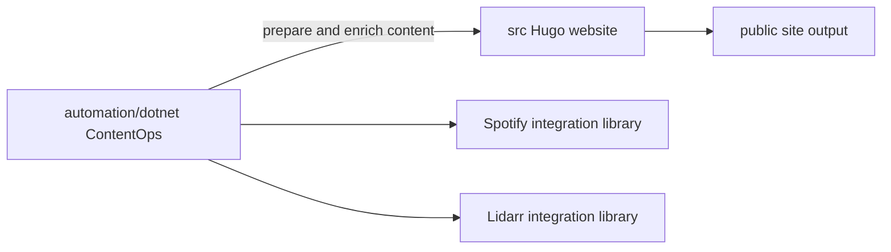
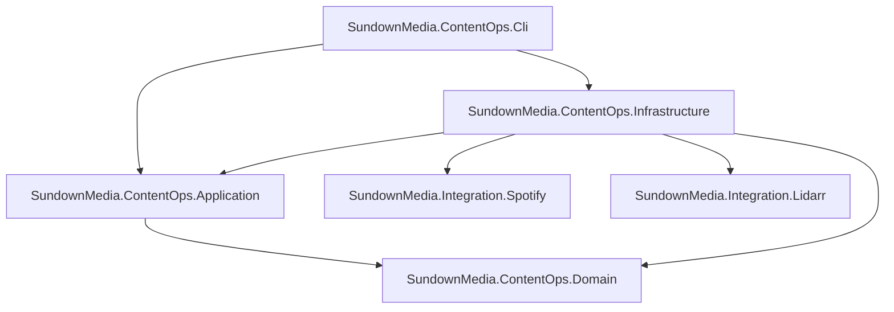

# Sundown Sessions

Sundown Sessions curates and publishes eclectic music sessions for listeners who want to discover beyond algorithmic playlists.


## Problem Statement

Curating a diverse catalogue of shows, artists, and episodes is difficult to do consistently when editorial content and music operations are handled in separate, informal workflows. This project exists to solve that by combining:

- a Hugo website that presents content clearly and consistently
- an automation platform that prepares and enriches music data before publication

Together, these workstreams improve discoverability, editorial quality, and operational repeatability.


## Project Overview

This repository contains two primary workstreams:

- [src/](src/): Hugo-based website content, templates, and static assets
- [automation/dotnet/](automation/dotnet/): ContentOps automation platform built with .NET and clean architecture boundaries

## Architecture Overview

At repository level, website publishing and automation are intentionally separated while still cooperating through content preparation flow.


```mermaid
flowchart LR
  A[automation/dotnet ContentOps] -->|prepare and enrich content| B[src Hugo website]
  B --> C[public site output]
  A --> D[Spotify integration library]
  A --> E[Lidarr integration library]
```

Within ContentOps, domain rules, orchestration, infrastructure, and CLI wiring are separated to preserve deterministic behaviour and testability.


```mermaid
flowchart TB
  CLI[SundownMedia.ContentOps.Cli] --> APP[SundownMedia.ContentOps.Application]
  APP --> DOMAIN[SundownMedia.ContentOps.Domain]
  CLI --> INFRA[SundownMedia.ContentOps.Infrastructure]
  INFRA --> APP
  INFRA --> DOMAIN
  INFRA --> SPOT[SundownMedia.Integration.Spotify]
  INFRA --> LID[SundownMedia.Integration.Lidarr]
```

For deeper automation architecture and operational detail, see [automation/dotnet/README.md](automation/dotnet/README.md).

## Setup Instructions

### Hugo Website Local Setup

Prerequisites:

- Hugo Extended (current stable release)

Run locally from the repository root:

```powershell
Set-Location src
hugo server
```

Build production output:

```powershell
Set-Location src
hugo --environment production
```

The local site is available at [http://localhost:1313](http://localhost:1313) by default.

### ContentOps .NET Local Setup

Prerequisites:

- .NET SDK 10.0.100 (pinned in [automation/dotnet/global.json](automation/dotnet/global.json))

Restore, build, and test:

```powershell
Set-Location automation/dotnet
dotnet restore SundownMedia.ContentOps.sln
dotnet build SundownMedia.ContentOps.sln --configuration Release --no-restore
dotnet test SundownMedia.ContentOps.sln --configuration Release --no-build
```

Publish the CLI binary (Linux self-contained):

```powershell
Set-Location automation/dotnet
dotnet publish src/SundownMedia.ContentOps.Cli/SundownMedia.ContentOps.Cli.csproj `
  --configuration Release `
  --runtime linux-x64 `
  --self-contained true `
  -p:PublishSingleFile=true `
  -p:DebugType=none `
  -p:DebugSymbols=false `
  --output ./publish
```

These commands mirror the release workflow in [.github/workflows/contentops-release.yml](.github/workflows/contentops-release.yml).

## Workstream Details

- Website content and layouts: [src/content/](src/content/) and [src/layouts/](src/layouts/)
- ContentOps solution root: [automation/dotnet/SundownMedia.ContentOps.sln](automation/dotnet/SundownMedia.ContentOps.sln)
- Integration libraries: [automation/dotnet/integrations/](automation/dotnet/integrations/)
- Automation tests: [automation/dotnet/tests/](automation/dotnet/tests/)

## Roadmap

This roadmap is indicative direction rather than a delivery commitment. Completed changes are recorded in [CHANGELOG.md](CHANGELOG.md).

### Now

- Improve contributor onboarding across both workstreams
- Keep website content structure consistent for artists and shows
- Stabilise ContentOps release and runtime guidance

### Next

- Expand ContentOps beyond initial album intake workflows
- Strengthen operational tracing and observability in automation flows
- Improve editorial tooling and content curation ergonomics

### Later

- Increase reuse of Spotify and Lidarr integration libraries across additional workflows
- Extend website discovery and presentation capabilities for long-tail catalogue content
- Formalise richer contributor documentation as the platform footprint grows

## Contribution Standards

- Keep changes scoped to the requested area and avoid unrelated refactors
- Use British English in documentation and user-facing text
- Keep architecture boundaries clear between website and automation concerns

## Branching Convention

- This repository uses trunk-based development with `main` as the only long-lived branch
- Create short-lived branches using `type/workstream/short-description`, for example `feat/src/add-artist-social-links`
- Merge changes to `main` via pull requests with conventional commit titles

The canonical branching and pull request policy is documented in [CONTRIBUTING.md](CONTRIBUTING.md).

Please read [CODE_OF_CONDUCT.md](CODE_OF_CONDUCT.md) before contributing.

## Releases and Versioning

- Release history and notable changes: [CHANGELOG.md](CHANGELOG.md)
- ContentOps release tags use the `contentops/v<version>` namespace

## GitHub Actions

| Workflow | Description |
| --- | --- |
| [](https://github.com/colin-gourlay/sundown-sessions/actions/workflows/lint-markdown.yml) | Markdown lint status |
| [](https://github.com/colin-gourlay/sundown-sessions/actions/workflows/deploy-github-pages.yml) | Production deployment status |

## Licence

[](LICENSE)

This project is licensed under the terms of the [MIT licence](LICENSE).