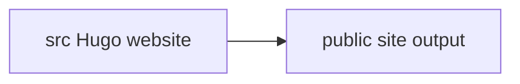

# Sundown Sessions

[](https://www.linkedin.com/in/colingourlay)

Sundown Sessions curates and publishes eclectic music sessions for listeners who want to discover beyond algorithmic playlists.


## Problem Statement

Curating a diverse catalogue of shows, artists, and episodes is difficult to do consistently when editorial content and music operations are handled in informal workflows. This project exists to solve that with:

- a Hugo website that presents content clearly and consistently

The site improves discoverability and editorial quality for the Sundown Sessions catalogue.


## Project Overview

This repository contains the Hugo-based website content, templates, and static assets under [src/](src/).

## Architecture Overview


```mermaid
flowchart LR
  A[src Hugo website] --> B[public site output]
```

## Setup Instructions

### Hugo Website Local Setup

Prerequisites:

- Hugo Extended (current stable release)

The site uses the [Blowfish](https://github.com/nunocoracao/blowfish) theme,
vendored as a git submodule under `src/themes/blowfish`. After cloning, run
`git submodule update --init --recursive` to fetch it. The investigation and
decision behind adopting Blowfish are recorded in
[docs/theme-investigation.md](docs/theme-investigation.md).

Run locally from the repository root:

```powershell
Set-Location src
hugo server
```

Build production output:

```powershell
Set-Location src
hugo --environment production
```

The local site is available at [http://localhost:1313](http://localhost:1313) by default.

### Website Analytics

Analytics is configured under `params.analytics` in
[`src/config/_default/params.toml`](src/config/_default/params.toml).
Placeholder values disable providers, so no live provider scripts are loaded
until real IDs are supplied.

- GA4 requires replacing `todo-measurement_id` with a real measurement ID.
- Microsoft Clarity requires replacing `todo-project_id` with a real project ID.
- Plausible and self-hosted Umami are reserved in configuration for future use.
- Custom events are sent through `window.sundownAnalytics.track(...)`.

## Workstream Details

- Website content and layouts: [src/content/](src/content/) and [src/layouts/](src/layouts/)

## Roadmap

This roadmap is indicative direction rather than a delivery commitment. Completed changes are recorded in [CHANGELOG.md](CHANGELOG.md).

### Now

- Improve contributor onboarding
- Keep website content structure consistent for artists and shows

### Next

- Improve editorial tooling and content curation ergonomics

### Later

- Extend website discovery and presentation capabilities for long-tail catalogue content
- Formalise richer contributor documentation as the platform footprint grows

## Contribution Standards

- Keep changes scoped to the requested area and avoid unrelated refactors
- Use British English in documentation and user-facing text
- Keep website content, layout, and configuration changes scoped to their relevant areas

## Branching Convention

- This repository uses trunk-based development with `main` as the only long-lived branch
- Create short-lived branches using `type/workstream/short-description`, for example `feat/src/add-artist-social-links`
- Merge changes to `main` via pull requests with conventional commit titles

The canonical branching and pull request policy is documented in [CONTRIBUTING.md](CONTRIBUTING.md).

Please read [CODE_OF_CONDUCT.md](CODE_OF_CONDUCT.md) before contributing.

## Releases and Versioning

- Release history and notable changes: [CHANGELOG.md](CHANGELOG.md)

## GitHub Actions

| Workflow | Description |
| --- | --- |
| [](https://github.com/colin-gourlay/sundown-sessions/actions/workflows/lint-markdown.yml) | Markdown lint status |
| [](https://github.com/colin-gourlay/sundown-sessions/actions/workflows/deploy-github-pages.yml) | Production deployment status |

## Licence

This repository uses two licences to reflect the different nature of its
components.

### Code and Structure

[](LICENSE)

The code, templates, automation scripts, configuration files, and structural
framework are licensed under the [MIT licence](LICENSE). You are free to
reuse, modify, and redistribute them, provided the copyright notice is
retained. Attribution to Colin Gourlay as the original author is required.

### Site Content

[](LICENSE-CONTENT)

The site content — including articles, show notes, artist profiles, episode
metadata, editorial text, images, and other media — is copyright Colin Gourlay.
All rights reserved. This content may not be copied, reproduced, redistributed,
or reused without explicit prior written permission. See [LICENSE-CONTENT](LICENSE-CONTENT)
for full terms.
