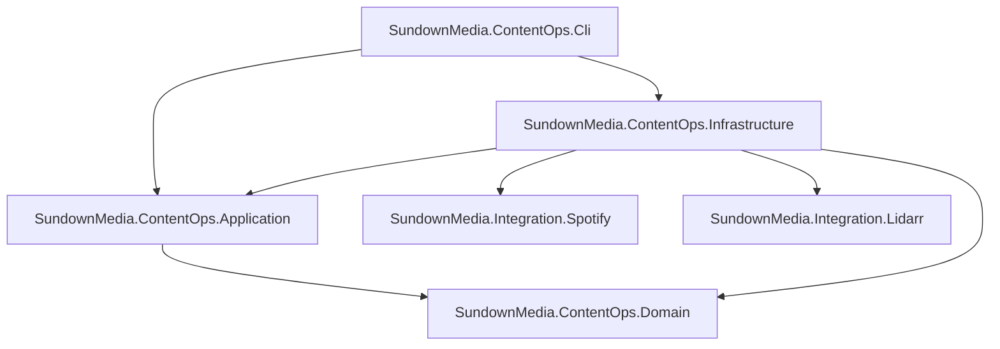

# SundownMedia ContentOps

SundownMedia ContentOps provides operational automation for music intake and preparation before curated content is published to the Hugo website.

## Purpose

The automation workspace under [automation/dotnet/](.) exists to make ingestion and pre-publication workflows repeatable, testable, and traceable.

Current focus:

- album intake and preparation workflows
- reusable Spotify and Lidarr integrations
- deterministic release packaging for binary and container runtime

## Architecture

The solution follows clean architecture boundaries:

- Domain: business state and rules
- Application: orchestration, validation, and command handling
- Infrastructure: persistence, external integrations, and technical concerns
- Cli: composition root and command-line entrypoint

Integrations are intentionally separate libraries so other workflows can reuse them:

- [integrations/SundownMedia.Integration.Spotify/](integrations/SundownMedia.Integration.Spotify/)
- [integrations/SundownMedia.Integration.Lidarr/](integrations/SundownMedia.Integration.Lidarr/)



## Prerequisites

- .NET SDK 10.0.100 (see [global.json](global.json))
- Docker (optional, for containerised runtime)

## Local Setup

Restore, build, and test:

```powershell
Set-Location automation/dotnet
dotnet restore SundownMedia.ContentOps.sln
dotnet build SundownMedia.ContentOps.sln --configuration Release --no-restore
dotnet test SundownMedia.ContentOps.sln --configuration Release --no-build
```

## Publish Local Binary

```powershell
Set-Location automation/dotnet
dotnet publish src/SundownMedia.ContentOps.Cli/SundownMedia.ContentOps.Cli.csproj `
  --configuration Release `
  --runtime linux-x64 `
  --self-contained true `
  -p:PublishSingleFile=true `
  -p:DebugType=none `
  -p:DebugSymbols=false `
  --output ./publish
```

## Docker Runtime

Build a local image:

```powershell
Set-Location automation/dotnet
docker build -f Dockerfile -t contentops:local .
```

Run help:

```powershell
docker run --rm -it contentops:local --help
```

## Testing Strategy

- Unit and application tests use NSubstitute
- Integration-style tests use Testcontainers and Respawn where relevant
- CI validates restore, build, and test before packaging

## Release Model

The release workflow [.github/workflows/contentops-release.yml](../../.github/workflows/contentops-release.yml) handles:

- manual releases via workflow dispatch
- tag-based releases using contentops/v* naming
- release asset generation (binary archive, Dockerfile, usage instructions)
- GHCR publication

## Contributing

When contributing to ContentOps:

- keep domain rules in Domain and orchestration in Application
- avoid exception-driven control flow for expected failures
- respect integration boundaries for Spotify and Lidarr libraries
- follow one-type-per-file conventions

For repository-wide standards, see [../../README.md](../../README.md) and [../../.github/copilot-instructions.md](../../.github/copilot-instructions.md).
